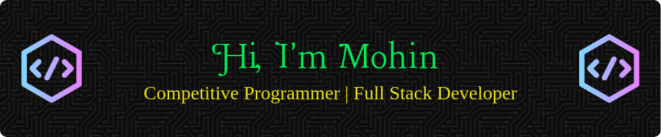

---
### 🛠 Tech Stack

- **Languages**: C, C++, Java, Python, JavaScript, TypeScript
- **Web Development**: MERN Stack (MongoDB, Express.js, React.js, Node.js)
- **Competitive Programming**: Data Structures, Algorithms, Dynamic Programming, and more

    
    
    
    
    
    
    
    
    
    
    
    
    

---

### 🏆 Competitive Programming

    

    
    
    
    <br/ >
    
    
    
    <br/ >
    
    
    
    <br/ >
    

---

### 🌐 Web Development

- Experienced in building full-stack web applications using the MERN stack.
- Knowledgeable in frontend technologies like **React.js** and backend technologies like **Node.js** with **Express.js**.
- Comfortable working with databases like **MongoDB**.

---

### My GitHub Stats :

---

### 📫 How to reach me:

- **Email**: mohin020399@gmail.com
- **LinkedIn**: [My LinkedIn](https://linkedin.com/in/)
- **GitHub**: [My GitHub](https://github.com/Eklas-Mohin)&nbsp;&nbsp;**Recursive Call Right?**

---

**Always eager to learn and take on new challenges!**
